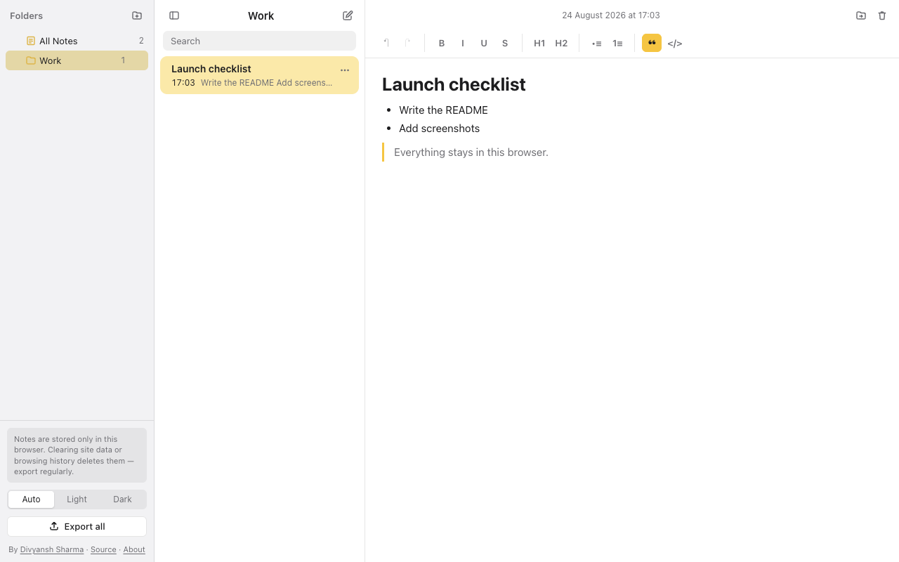
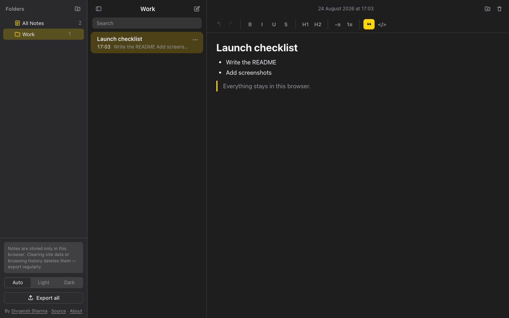
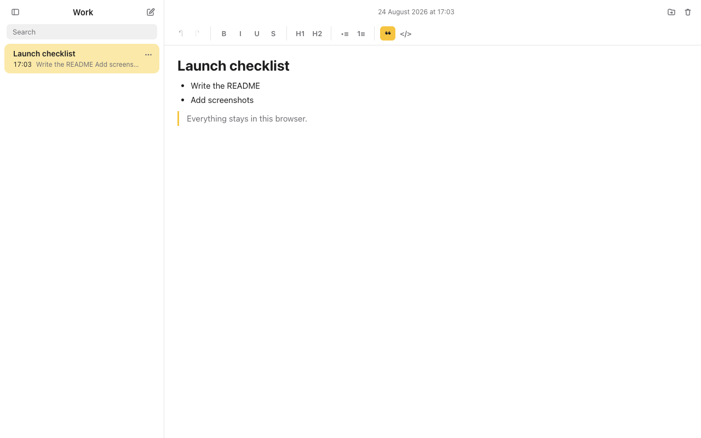
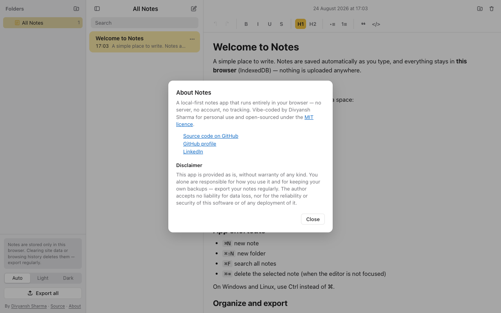

# Notes — a local-first, browser-only notepad

[](https://github.com/divyanshS/browser-notepad/actions/workflows/deploy.yml)


A lightweight note-taking app that runs entirely in your browser. There is no server, no account, and no network traffic: every note is stored in your browser's IndexedDB and never leaves your machine.



<details>
<summary>More screenshots — dark theme, collapsed folder pane, about dialog</summary>




</details>

> **About this project.** This is a vibe-coded tool: it was built with an AI coding assistant from a short product spec, for my own personal use, and then opened up in case it helps others. It is shared as-is under the MIT licence — use it, fork it, and adapt it however you like. It works well for me, but treat it as a hobby project rather than a supported product.
>
> Built by **[Divyansh Sharma](https://www.linkedin.com/in/sharma-divyansh/)** · [GitHub](https://github.com/divyanshS) · [Repository](https://github.com/divyanshS/browser-notepad)

## ⚠️ Your notes live only in this browser

- Everything is saved in the **IndexedDB of the browser profile you are using**. Nothing is synced or backed up anywhere.
- **Clearing site data, clearing browsing history/cookies, using a private window, or uninstalling the browser deletes all notes permanently.** Different browsers and devices each have their own, separate set of notes.
- Use **Export all** (bottom of the folder pane) regularly. It downloads a `.zip` of plain Markdown files — your notes in an open format you can keep anywhere.

## Features

- **Three panes** — folders · note list with search · editor. The folder pane can be collapsed; light/dark follows your OS or your explicit choice (Auto / Light / Dark).
- **Folders** — create (top level or nested via *New Subfolder*), rename (double-click or ⋯ menu), delete (sub-folders go too; their notes are kept and become *unfiled* under *All Notes*), export a folder subtree.
- **Notes** — the first line is the title; list sorted by last edit; move between folders with *Move to…* or drag-and-drop (drop on *All Notes* to unfile); delete with confirmation.
- **Editor** — bold, italic, underline, strikethrough, H1–H3, bullet/numbered lists, blockquote, code block, undo/redo. Markdown shortcuts: `# `, `## `, `- ` / `* `, `1. `, `> `, ```` ``` ````. Images are rejected on paste and drop to keep storage small.
- **Auto-save** — 500 ms after you stop typing, and immediately on blur, note switch, tab hide or unload.
- **Search** — as-you-type across all notes, typo-tolerant, with matches highlighted.
- **Export** — *Export all* or *Export Folder…* produces a `.zip` where folders are directories and notes are `.md` files.

### Keyboard shortcuts (Ctrl instead of ⌘ on Windows/Linux)

| Shortcut | Action |
| --- | --- |
| ⌘N | New note |
| ⌘⇧N | New folder |
| ⌘F | Focus search (Esc clears) |
| ⌘⌫ | Delete selected note (when the editor is not focused) |
| ⌘Z / ⌘⇧Z | Undo / redo |
| ⌘B / ⌘I / ⌘U / ⌘⇧X | Bold / italic / underline / strikethrough |
| ↑ / ↓ | Move selection in the note list |

## Run it locally

Requires Node ≥ 20.19 (see `.nvmrc`).

```bash
npm ci
npm run dev        # http://localhost:5173
```

Other scripts: `npm test` (unit tests), `npm run typecheck`, `npm run lint`, `npm run build` (production build in `dist/`), `npm run preview`.

## Deploying to GitHub Pages

The workflow in `.github/workflows/deploy.yml` runs typecheck, lint, tests and the build on every push to `main`, then publishes `dist/` to GitHub Pages. One-time setup: in the repository go to **Settings → Pages** and set **Source** to **GitHub Actions**. The Vite `base` path is derived from the repository name automatically.

## Tech stack

| Concern | Choice |
| --- | --- |
| UI | React 19 + Vite 8 + TypeScript |
| Rich text | Tiptap 3 (headless ProseMirror) |
| Storage | IndexedDB via Dexie 4 |
| Search | MiniSearch (fuzzy + prefix) |
| Export | JSZip (loaded on demand) |
| Tests | Vitest + jsdom + fake-indexeddb + Testing Library |

See [AGENTS.md](AGENTS.md) for the architecture and conventions (written for AI coding agents, useful for humans too).

## Disclaimer

This software is provided **as is, without warranty of any kind**, express or implied. You alone are responsible for how you use it and for keeping your own backups — export your notes regularly.

The author accepts **no liability** for any data loss, nor for the reliability, availability or security of this software or of any deployment of it, including the hosted GitHub Pages build. If you self-host or fork it, you are responsible for your own deployment. See the [MIT licence](LICENSE) for the full legal terms.

## Author

Made by **Divyansh Sharma**.

- LinkedIn — [in/sharma-divyansh](https://www.linkedin.com/in/sharma-divyansh/)
- GitHub — [@divyanshS](https://github.com/divyanshS)
- Repository — [divyanshS/browser-notepad](https://github.com/divyanshS/browser-notepad)

If you find this useful, a ⭐ on the repository is always appreciated.

## License

[MIT](LICENSE) © Divyansh Sharma
